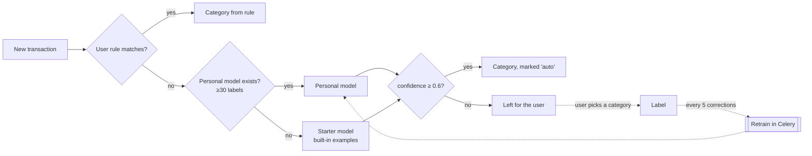

# FinSight

[](https://github.com/ebrahimmorkas/finsight/actions/workflows/ci.yml)


**FinSight** is a personal finance tracker that **categorizes your bank transactions with
machine learning**. Import a CSV statement from any bank and FinSight cleans up the merchant
names, sorts every transaction into a category with a per-user scikit-learn model that learns
from your corrections, tracks budgets, finds your subscriptions and recurring bills, and charts
where the money goes.

---

## Features

- **CSV import that copes with real bank exports:** auto-detects delimiter, columns (amount or debit/credit), day-first vs month-first dates and number formats such as `1.234,56` and `(12.50)`. Re-importing an overlapping statement never creates duplicates
- **Merchant normalization:** `POS DEBIT 0412 NETFLIX.COM 866-579-7172 CA` → `NETFLIX`
- **ML categorization:** user rules → personal model → starter model, applied only above a confidence threshold. It retrains itself after you fix a few categories
- **Recurring-payment detection:** finds weekly, monthly and yearly charges with stable amounts, predicts the next charge and totals your monthly commitments
- **Budgets** per category with progress bars and email alerts (once per threshold per month)
- **Dashboard:** income, spending, savings rate, 12-month cash flow and category breakdown (Chart.js)
- **REST API** with token auth and OpenAPI docs; new transactions are auto-categorized on create

## How the categorization works



| Step | Detail |
| --- | --- |
| Features | TF-IDF over **character n-grams (2–5)** and word uni/bigrams of normalized merchant + description, plus money-in/out and log-amount |
| Model | Multinomial **logistic regression**, balanced class weights. Fast to train per user and gives usable probabilities |
| Evaluation | Stratified k-fold cross-validation, shown in the UI (the demo user's model scores ~98% on its labelled data) |
| Safety | Trains only on labels from the user or their rules, **never on its own predictions**, so no feedback loop |
| Storage | Serialized with joblib into the database, one model per user |

## Tech stack

| Layer | Technology |
| --- | --- |
| Backend | Django 6, Django REST Framework, django-filter, drf-spectacular |
| ML | scikit-learn, joblib |
| Frontend | Django templates, HTMX, Chart.js |
| Async | Celery 5 + beat *(Redis optional)* |
| Data | PostgreSQL *(SQLite fallback)*, Redis cache *(optional)* |
| Quality | pytest (100 tests, 96% coverage), Ruff, GitHub Actions |
| Ops | Docker (multi-stage, non-root), docker-compose |

```
apps/
├── accounts/        # email login
├── ledger/          # accounts, categories, transactions, merchant normalization
├── imports/         # CSV parser and de-duplicating importer
├── categorization/  # rules, scikit-learn pipeline, training/retraining
├── budgets/         # monthly budgets and alerts
├── insights/        # dashboard analytics, recurring-payment detection
├── api/             # REST API
└── core/            # home, health, seed_demo
```

## Redis is optional

| Variable | Set | Not set |
| --- | --- | --- |
| `DATABASE_URL` | PostgreSQL | SQLite |
| `REDIS_URL` | Redis cache + Celery broker (training and categorization in workers) | Local-memory cache, Celery tasks run eagerly in-process |

CI runs the full suite in both configurations.

## Getting started

```bash
python -m venv .venv && source .venv/bin/activate   # Windows: .venv\Scripts\activate
pip install -r requirements-dev.txt
cp .env.example .env
python manage.py migrate
python manage.py seed_demo       # demo@finsight.dev / demo-pass-123, six months of data
python manage.py runserver
```

Or with Docker (PostgreSQL, Redis, worker, beat):

```bash
docker compose up --build
docker compose exec web python manage.py seed_demo
```

### Try the API

```bash
TOKEN=$(curl -s -X POST localhost:8000/api/v1/auth/token/ \
  -d "username=demo@finsight.dev&password=demo-pass-123" | jq -r .token)

curl -s -X POST localhost:8000/api/v1/transactions/ -H "Authorization: Token $TOKEN" \
  -H "Content-Type: application/json" \
  -d '{"account": 1, "date": "2026-10-01", "description": "UBER *TRIP HELP.UBER.COM", "amount": "-14.20"}'
# -> "category_name": "Transport", "categorized_by": "ml", "confidence": 0.7…

curl -s localhost:8000/api/v1/summary/ -H "Authorization: Token $TOKEN"
```

Interactive docs: <http://localhost:8000/api/v1/docs/>

## Design decisions

**Import de-duplication.** Each row's hash combines account, date, amount, description and the
row's *occurrence number* among identical rows in the same file. Two real €4.50 coffees on the
same day stay two transactions, but importing the same or an overlapping statement again adds
nothing. A partial unique constraint enforces it at the database level.

**Rules before ML, and confidence before automation.** Users always stay in control: explicit
rules win, and low-confidence predictions are left blank rather than guessed. Every
auto-categorized transaction is visibly marked and fixable in one click (HTMX), and each fix
feeds the next training run.

**Recurring detection is plain statistics.** Median gap between payments, a regularity check
and the coefficient of variation of amounts. It's explainable, fast, and unit-tested as a pure
function.

**Cache invalidation that also covers bulk writes.** Dashboard data is cached per user under a
versioned key. `bulk_create`/`bulk_update` skip `post_save`, so imports and auto-categorization
send an explicit `transactions_changed` event to bump the version.

## Testing

```bash
pytest                      # SQLite, no Redis
pytest --cov                # coverage
ruff check . && ruff format --check .
```

## License

MIT
